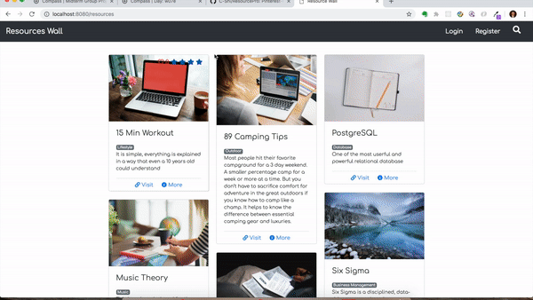

# Resource Wall Project

Midterm project for Lighthouse Labs. A fully functioning full-stack pinterest clone, which allows users to share educational resources found across the web. Users can share, rate, and comment on different resources. Built with NodeJS, Express, Bootstrap, jQuery, PostgreSQL.

## Final Product

## Dependencies

* body-parser
* connect-flash
* cookie-session
* dotenv
* ejs
* express
* knex
* knex-logger
* moment
* morgan
* node-sass-middleware
* pg

## Dev Dependencies

* nodemon

## Installation

* clone project to local machine, with NodeJS, npm, and PostgreSQL installed.
* update .env file with correct local credentials.
* Run `npm install` for dependencies
* Run sass `npm rebuild node-sass`
* Run migrations `npm run knex migrate:latest`
* Run data seed file `npm run knex seed:run`
* Run the server: `npm run local`
* Visit `http://localhost:8080/`

Version 1.0.0

Created by
* Mackenzie Bullock
* Cheng Shi
* Janaki Patel